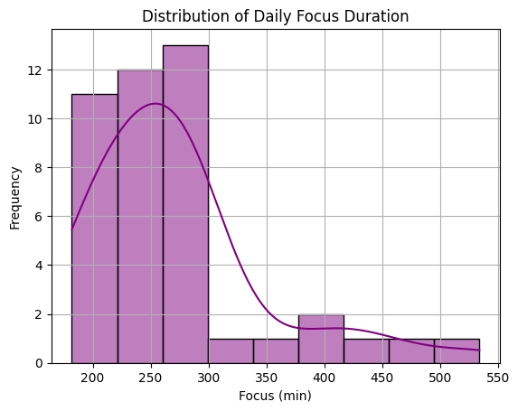

# DSA210-TermProject

I am Berkay Kesgin, a student from Sabancı University, and this is my DSA210 (Introduction to Data Science) Term Project.
In this project, I will analyze the relationship between coffee and water consumption and their effects on focus duration and sleep patterns, supported by my collected data.

# Table of Contents

1. [Project Overview](#project-overview)
2. [Objectives](#objectives)
3. [Motivation](#motivation)
4. [Data Collection & Sources](#data-collection)
5. [Data Preprocessing] (#data-preprocessing)
   
# Project Overview

Coffee is often associated with improved focus and productivity, while excessive intake may disrupt sleep. Likewise, proper hydration plays a crucial role in cognitive performance and well-being. But how do these factors interact?

This project aims to uncover the real impact of coffee and water consumption on focus and sleep quality using data-driven analysis. Over the next months, I will systematically track my daily intake, analyze focus patterns, and identify trends in sleep efficiency to better understand these relationships.

# Objectives

**Understanding the Impact of Beverage Consumption on Focus & Sleep**
- Analyze how coffee and water intake influence focus duration and sleep quality.
- Assess whether coffee timing affects sleep efficiency.
- Determine if higher water intake enhances cognitive performance and sleep duration.

**Applying Data Science Techniques**
- Conduct statistical analysis and hypothesis testing.
- Use data visualization to identify trends and correlations.
- Apply DSA210 concepts to a real-world dataset based on personal habits.

# Motivation

**Personal Curiosity**

I have always wondered if my focus levels and sleep patterns are truly affected by coffee and water intake or if it is just a perception.
This project will help me identify whether my habits influence my cognitive performance and sleep quality. By systematically collecting and analyzing data, I can determine if there are noticeable trends or if external factors play a bigger role than I assumed.

**Data-Driven Decision Making**

Rather than relying on assumptions, I want to use quantifiable data to answer these questions. Tracking my daily coffee and water intake, focus duration, and sleep efficiency will provide objective insights into my habits. This process will also encourage me to be more mindful of my consumption patterns and their effects.

**Applying Data Science in Real Life**

This project allows me to apply the skills I’ve learned in DSA210 to a real-world dataset that directly impacts my daily life. By using statistical analysis, hypothesis testing, and visualization techniques, I will uncover meaningful correlations and refine my ability to analyze complex behavioral data.

Ultimately, my goal is to identify actionable insights that help me optimize my routines for better focus, productivity, and sleep quality.

# Data Collection

## **Beverage Consumption**
- **Coffee Intake (ml):** Total amount of coffee consumed that day, manually recorded.
- **Caffeine Intake (mg):** Estimated caffeine amount based on the type and volume of coffee.
- **Water Intake (ml):** Total amount of water consumed per day.
- **Sugar Intake from Coffee (mg):** Amount of sugar added to coffee, manually recorded.

## **Focus and Cognitive Performance**
- **Focus Duration (min):** Total time spent in focused work, measured using the Pomodoro technique.
- **Screen Time (min):** Total daily screen time, recorded via phone settings.

## **Sleep Patterns**
- **Sleep Start Time:** The exact time the user went to sleep, recorded from a smartwatch.
- **Sleep End Time:** The exact time the user woke up, recorded from a smartwatch.
- **Total Sleep Duration (hours):** The total duration of sleep for that night, retrieved from a smartwatch.
- **Sleep Quality (%):** Percentage-based metric evaluating sleep efficiency, recorded from a smartwatch.
- **Last Coffee Intake Before Bed (hours before sleep):** Time elapsed between the last coffee consumed and sleep onset.

## **Environmental Factors**
- **Ambient Temperature (°C):** The daily average temperature, retrieved from a weather API.

# Data Preprocessing

The preprocessing was performed in data_process.ipynb, and the cleaned dataset is stored as cleaned_focus_sleep_data.xlsx.

- Datetime Parsing: Sleep start/end times were converted to datetime format to calculate Sleep (hrs).
- Feature Engineering: New binary columns were added:
  -	High Coffee → coffee > 600 ml
  -	High Water → water > 1200 ml
  -	High Focus → focus > 300 minutes

- Time Features: Extracted Sleep Start Hour and Sleep End Hour for pattern analysis.
- Column Reordering: Columns were rearranged for better readability and analysis compatibility.
- Missing Value Check: No null values were found in the final dataset.

# Exploratory Data Analysis (EDA)
## 1. Variable Distributions
   -  Distribution of Daily Focus Duration
      Displays how focus time is distributed across days.
      
